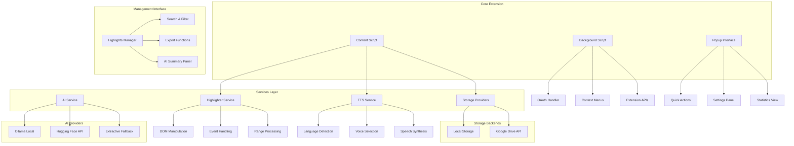

# Universal Web Highlighter

A free, open-source Chrome extension for highlighting text on web pages with **Google Drive sync**, **AI-powered summaries**, and **multilingual text-to-speech**.


## ✨ Features

### 🎯 Core Highlighting
- **Text Selection & Highlighting** - Select any text and highlight with customizable colors
- **Persistent Storage** - Highlights survive page reloads and browser restarts
- **Hover Actions** - Delete highlights with hover-activated delete buttons
- **Smart Overlapping** - Automatically handles overlapping highlight ranges
- **Context Menu** - Right-click integration for quick highlighting

### ☁️ Cloud Synchronization
- **Google Drive Integration** - Automatic sync across all your devices
- **Real-time Backup** - Highlights are automatically saved to Google Drive
- **Cross-Device Access** - Access your highlights from any browser, anywhere
- **Offline Support** - Works offline with automatic sync when reconnected

### 🤖 AI-Powered Features
- **Smart Summaries** - Generate AI summaries from your highlighted content
- **Multiple AI Providers** - Supports Ollama (local), Hugging Face, and extractive fallback
- **Context-Aware** - Summaries understand page context and highlight relationships

### 🗣️ Text-to-Speech
- **Multilingual TTS** - Automatically detects page language and selects appropriate voice
- **19+ Language Support** - English, Spanish, French, German, Italian, Portuguese, Japanese, Chinese, and more
- **Neural Voice Priority** - Automatically selects highest quality voices available
- **Highlight Narration** - Listen to individual highlights or entire AI summaries

### 📊 Advanced Management
- **Web-based Manager** - Comprehensive highlight management interface
- **Search & Filter** - Find highlights by content, date, notes, or website
- **Export Options** - Export to JSON, HTML, or Markdown formats
- **Note Taking** - Add personal notes to any highlight
- **Statistics Dashboard** - Track your highlighting activity over time

## 🚀 Quick Start

### Installation

1. **Download the Extension**
   ```bash
   git clone https://github.com/your-username/chrome-highlighter.git
   cd chrome-highlighter
   ```

2. **Load in Chrome**
   - Open Chrome and go to `chrome://extensions/`
   - Enable "Developer mode" (top right toggle)
   - Click "Load unpacked"
   - Select the `chrome-highlighter` folder

3. **Start Highlighting**
   - Visit any webpage
   - Select text and click the highlight button
   - Your highlights are automatically saved!

### First Use

1. **Highlight Text**: Select any text → Click the blue highlight button
2. **Choose Colors**: Right-click highlighted text → Select new color
3. **Add Notes**: Right-click highlighted text → "Edit note"
4. **Manage Highlights**: Click extension icon → "Manage Highlights"

## 📋 Setup Guide

### Basic Setup (Local Storage Only)
- No additional setup required
- Highlights stored locally in browser
- Works immediately after installation

### Google Drive Setup (Recommended)
For cross-device sync, follow our [Google Drive Setup Guide](docs/GOOGLE_DRIVE_SETUP.md).

**Quick Google Drive Setup:**
1. Visit [Google Cloud Console](https://console.cloud.google.com/)
2. Create a new project or select existing
3. Enable Google Drive API
4. Create OAuth 2.0 credentials
5. Add your Chrome extension ID to authorized origins
6. Update `manifest.json` with your `client_id`

### AI Features Setup
- **Local AI**: Install [Ollama](https://ollama.ai/) for privacy-focused AI summaries
- **Cloud AI**: Uses Hugging Face Inference API (free tier available)
- **Fallback**: Extractive summaries work without any setup

## 🏗️ Architecture



## 🎨 How to Use

### Basic Highlighting
1. **Select text** on any webpage
2. **Click the highlight button** that appears
3. **Choose a color** from the popup (optional)
4. Your highlight is automatically saved!

### Advanced Features

#### Adding Notes
- Right-click any highlight
- Select "Edit note"
- Add your personal notes
- Notes are included in TTS narration

#### Color Management
- Right-click highlighted text
- Choose from 8 predefined colors
- Colors persist across sessions

#### Text-to-Speech
- Click the 🔊 button on any highlight
- Extension automatically detects page language
- Selects best available voice for that language
- Click ⏹️ to stop playback

#### AI Summaries
1. Open Highlights Manager
2. Select a page with multiple highlights
3. Click "Generate AI Summary"
4. Listen to summary with TTS
5. Export summary as Markdown

#### Searching & Filtering
- **Search bar**: Find highlights by text content or notes
- **Date filters**: Today, This Week, This Month
- **Notes filter**: Show only highlights with notes
- **Export**: Download filtered results

## 🔧 Configuration

### TTS Language Settings
```javascript
// Access TTS service in console
const tts = window.ttsService;

// Check detected language
tts.getDetectedLanguage(); // Returns: 'en', 'es', 'fr', etc.

// Enable/disable auto-language
tts.setAutoLanguage(true);  // Enable auto-detection
tts.setAutoLanguage(false); // Disable auto-detection

// Force specific language
tts.forceLanguage('es');    // Force Spanish
tts.forceLanguage('fr');    // Force French

// Reset to page language
tts.resetLanguageDetection();

// Get language info
tts.getLanguageInfo();
/*
Returns:
{
  detected: "en",
  autoEnabled: true,
  currentVoice: { name: "Microsoft Aria", lang: "en-US" },
  supportedLanguages: ["en", "es", "fr", "de", ...]
}
*/
```

### Storage Configuration
- **Local Storage**: Always available, browser-specific
- **Google Drive**: Requires OAuth setup, cross-device sync
- **Hybrid Mode**: Local primary, cloud backup (recommended)

### AI Configuration
Configure AI providers in the popup settings:
- **Ollama**: Local AI processing (privacy-focused)
- **Hugging Face**: Cloud AI processing (requires API key)
- **Extractive**: Simple text extraction (always available)

## 📁 Project Structure

```
chrome-highlighter/
├── manifest.json              # Extension configuration
├── content-script.js          # Main page injection script
├── background.js              # Extension background service
├── popup.html                 # Extension popup interface
├── popup.js                   # Popup functionality
├── highlights-manager.html    # Web-based highlight manager
├── highlights-manager.js      # Manager functionality
├── highlighter-service.js     # Core highlighting logic
├── storage-providers.js       # Storage abstraction layer
├── tts-service.js            # Text-to-speech service
├── ai-summary-service.js     # AI integration service
├── interfaces.js             # TypeScript-like interfaces
├── highlight-styles.css      # Injected CSS styles
├── options.html              # Extension options page
├── options.js                # Options functionality
├── icons/                    # Extension icons
│   ├── icon-16.png
│   ├── icon-48.png
│   └── icon-128.png
└── docs/                     # Documentation
    └── GOOGLE_DRIVE_SETUP.md
```

## 🌍 Language Support

### Supported TTS Languages
- **English** (en) - Multiple regional variants
- **Spanish** (es) - Spain & Latin America
- **French** (fr) - France & Canada
- **German** (de) - Standard German
- **Italian** (it) - Standard Italian
- **Portuguese** (pt) - Brazil & Portugal
- **Japanese** (ja) - Standard Japanese
- **Chinese** (zh) - Mandarin (Simplified)
- **Russian** (ru) - Standard Russian
- **Arabic** (ar) - Modern Standard Arabic
- **Hindi** (hi) - Standard Hindi
- **Dutch** (nl) - Netherlands
- **Swedish** (sv) - Standard Swedish
- **Danish** (da) - Standard Danish
- **Norwegian** (no) - Bokmål
- **Finnish** (fi) - Standard Finnish
- **Polish** (pl) - Standard Polish
- **Turkish** (tr) - Standard Turkish

### Language Detection Methods
1. **HTML `lang` attribute** (Primary)
2. **Meta content-language tag**
3. **Open Graph locale meta tag**
4. **Browser language** (Fallback)

## 🔒 Privacy & Security

### Data Storage
- **Local highlights**: Stored in browser's local storage
- **Google Drive sync**: Encrypted in transit, stored in your personal Google Drive
- **No third-party tracking**: Extension doesn't collect analytics or personal data

### Permissions Used
- `storage` - Save highlights locally
- `activeTab` - Access current page for highlighting
- `identity` - Google Drive OAuth authentication
- `scripting` - Inject highlight functionality
- `contextMenus` - Right-click menu integration
- `alarms` - Periodic sync scheduling
- `downloads` - Export functionality

### AI Processing
- **Ollama**: Completely local, no data leaves your device
- **Hugging Face**: Data sent to Hugging Face API (check their privacy policy)
- **Extractive**: Local processing, no external API calls

## 🤝 Contributing

We welcome contributions! Here's how to get started:

1. **Fork the repository**
2. **Create a feature branch**: `git checkout -b feature/amazing-feature`
3. **Make your changes** and test thoroughly
4. **Commit your changes**: `git commit -m "Add amazing feature"`
5. **Push to the branch**: `git push origin feature/amazing-feature`
6. **Open a Pull Request**

### Development Setup
```bash
# Clone the repository
git clone https://github.com/your-username/chrome-highlighter.git
cd chrome-highlighter

# Load extension in Chrome developer mode
# Make changes and reload extension to test
```

### Code Style
- Use ES6+ features where appropriate
- Follow existing naming conventions
- Add comments for complex logic
- Test across different websites and languages

## 📝 License

This project is licensed under the MIT License - see the [LICENSE](LICENSE) file for details.

## 🙏 Acknowledgments

- **Chrome Extensions API** - Foundation for browser integration
- **Google Drive API** - Cloud storage and synchronization
- **Web Speech API** - Text-to-speech functionality
- **Ollama** - Local AI processing capabilities
- **Hugging Face** - Cloud AI inference services

## 📞 Support

- **Issues**: [GitHub Issues](https://github.com/your-username/chrome-highlighter/issues)
- **Discussions**: [GitHub Discussions](https://github.com/your-username/chrome-highlighter/discussions)
- **Email**: support@your-domain.com

---

**Made with ❤️ for researchers, students, and knowledge workers worldwide.**