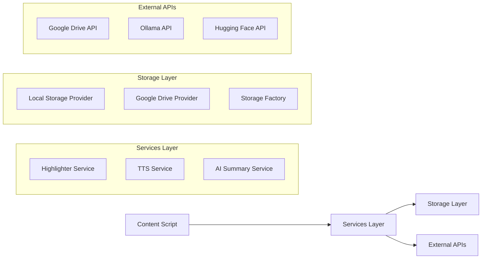

# API Documentation - Universal Web Highlighter

This document describes the internal APIs and interfaces for developers who want to extend or integrate with the Universal Web Highlighter extension.

## 🏗️ Architecture Overview

The extension follows a modular architecture with clear separation of concerns:



## 📚 Core Interfaces

### IHighlighter Interface

```typescript
interface IHighlighter {
  highlight(range: Range, color?: string): Promise<Highlight>;
  removeHighlight(highlightId: string): Promise<boolean>;
  updateHighlight(highlight: Highlight): Promise<boolean>;
  getHighlights(): Map<string, Highlight>;
  searchHighlights(query: string): Promise<Highlight[]>;
  exportHighlights(format: string, scope: string): Promise<string>;
}
```

### IStorageProvider Interface

```typescript
interface IStorageProvider {
  save(key: string, data: any): Promise<boolean>;
  load(key: string): Promise<any>;
  delete(key: string): Promise<boolean>;
  list(): Promise<string[]>;
  clear(): Promise<boolean>;
  getSyncStatus(): Promise<SyncStatus>;
}
```

### Highlight Data Structure

```typescript
interface Highlight {
  id: string;                    // Unique identifier
  text: string;                  // Highlighted text content
  url: string;                   // Page URL
  title: string;                 // Page title
  color: string;                 // Highlight color (hex)
  timestamp: number;             // Creation timestamp
  note?: string;                 // Optional user note
  range: {                       // Text position data
    startContainer: string;      // Start node selector
    startOffset: number;         // Start character offset
    endContainer: string;        // End node selector
    endOffset: number;           // End character offset
  };
  context: {                     // Surrounding context
    before: string;              // Text before highlight
    after: string;               // Text after highlight
  };
}
```

## 🎯 Highlighter Service API

### Core Methods

#### `highlight(range, color)`
Creates a new highlight from a text selection.

```javascript
// Example usage
const range = window.getSelection().getRangeAt(0);
const highlight = await highlighter.highlight(range, '#ffff00');
console.log('Created highlight:', highlight.id);
```

**Parameters:**
- `range` (Range): DOM Range object representing selected text
- `color` (string, optional): Hex color code (default: '#ffff00')

**Returns:** Promise<Highlight>

#### `removeHighlight(highlightId)`
Removes a highlight by ID.

```javascript
// Example usage
const success = await highlighter.removeHighlight('highlight-123');
console.log('Highlight removed:', success);
```

**Parameters:**
- `highlightId` (string): Unique highlight identifier

**Returns:** Promise<boolean>

#### `updateHighlight(highlight)`
Updates an existing highlight.

```javascript
// Example usage
const highlight = highlighter.getHighlights().get('highlight-123');
highlight.note = 'Updated note';
highlight.color = '#ff0000';
await highlighter.updateHighlight(highlight);
```

**Parameters:**
- `highlight` (Highlight): Updated highlight object

**Returns:** Promise<boolean>

### Event System

The highlighter service emits events that you can listen to:

```javascript
// Listen to highlight events
window.highlighterEvents.on('highlightCreated', (highlight) => {
  console.log('New highlight created:', highlight);
});

window.highlighterEvents.on('highlightRemoved', (highlightId) => {
  console.log('Highlight removed:', highlightId);
});

window.highlighterEvents.on('highlightUpdated', (highlight) => {
  console.log('Highlight updated:', highlight);
});
```

### Available Events
- `highlightCreated` - New highlight added
- `highlightRemoved` - Highlight deleted
- `highlightUpdated` - Highlight modified
- `highlightsLoaded` - Highlights restored from storage
- `syncStatusChanged` - Storage sync status updated

## 🗣️ TTS Service API

### Core Methods

#### `speak(text, highlightId, options)`
Converts text to speech with automatic language detection.

```javascript
// Basic usage
ttsService.speak('Hello world');

// With options
ttsService.speak('Bonjour le monde', 'highlight-123', {
  rate: 0.8,
  pitch: 1.2,
  volume: 0.9
});
```

**Parameters:**
- `text` (string): Text to speak
- `highlightId` (string, optional): Associated highlight ID
- `options` (object, optional): Speech options

#### `getLanguageInfo()`
Returns current language detection information.

```javascript
const info = ttsService.getLanguageInfo();
console.log(info);
// Output:
// {
//   detected: "fr",
//   autoEnabled: true,
//   currentVoice: { name: "Thomas", lang: "fr-FR" },
//   supportedLanguages: ["en", "fr", "es", ...]
// }
```

#### `setAutoLanguage(enabled)`
Enables or disables automatic language detection.

```javascript
ttsService.setAutoLanguage(true);  // Enable auto-detection
ttsService.setAutoLanguage(false); // Use default language
```

#### `forceLanguage(languageCode)`
Temporarily override detected language.

```javascript
ttsService.forceLanguage('es'); // Force Spanish
ttsService.forceLanguage('ja'); // Force Japanese
```

### Language Detection

The TTS service automatically detects page language using multiple methods:

1. **HTML `lang` attribute**
2. **Meta content-language tag**
3. **Open Graph locale**
4. **Browser language (fallback)**

```javascript
// Check detection methods
console.log('Page language detection:');
console.log('HTML lang:', document.documentElement.lang);
console.log('Meta content-language:',
  document.querySelector('meta[http-equiv="content-language"]')?.content);
console.log('Detected:', ttsService.getDetectedLanguage());
```

## 🤖 AI Summary Service API

### Core Methods

#### `generateSummary(highlights, pageTitle)`
Generates AI-powered summary from highlights.

```javascript
// Generate summary
const highlights = Array.from(highlighter.getHighlights().values());
const result = await aiService.generateSummary(highlights, document.title);

console.log('Summary:', result.summary);
console.log('Provider:', result.provider);
console.log('Word count:', result.wordCount);
```

**Parameters:**
- `highlights` (Highlight[]): Array of highlight objects
- `pageTitle` (string, optional): Page title for context

**Returns:** Promise<SummaryResult>

```typescript
interface SummaryResult {
  summary: string;              // Generated summary text
  provider: string;             // AI provider used
  wordCount: number;            // Summary word count
  isFallback: boolean;          // True if extractive fallback used
}
```

### AI Providers

The service supports multiple AI providers with automatic fallback:

#### Ollama (Local AI)
```javascript
// Configure Ollama
const ollamaConfig = {
  baseUrl: 'http://localhost:11434',
  model: 'llama2:7b',
  temperature: 0.7
};
```

#### Hugging Face (Cloud AI)
```javascript
// Configure Hugging Face
const hfConfig = {
  apiKey: 'your-api-key-here',
  model: 'facebook/bart-large-cnn',
  maxLength: 150
};
```

#### Extractive Fallback
Automatically used when other providers fail:
- No external dependencies
- Local text processing
- Extracts key sentences from highlights

## 💾 Storage Providers API

### Local Storage Provider

Stores data in browser's local storage:

```javascript
const localStorage = new LocalStorageProvider();

// Save highlight
await localStorage.save('domain.com_highlight-123', highlight);

// Load highlight
const highlight = await localStorage.load('domain.com_highlight-123');

// List all keys
const keys = await localStorage.list();
```

### Google Drive Provider

Syncs data with Google Drive:

```javascript
const driveStorage = new DirectGoogleDriveProvider();

// Check authentication
const isAuthenticated = await driveStorage.isAuthenticated();

// Authenticate if needed
if (!isAuthenticated) {
  await driveStorage.authenticate();
}

// Save with automatic cloud sync
await driveStorage.save('domain.com_highlight-123', highlight);
```

### Storage Factory

Creates appropriate storage provider:

```javascript
// Create Google Drive provider with local fallback
const storage = StorageFactory.createDirectGoogleDrive();

// Create local-only provider
const localStorage = StorageFactory.createLocal();
```

## 🎨 Style Customization API

### CSS Custom Properties

The extension supports CSS custom properties for theming:

```css
/* Customize highlight colors */
:root {
  --highlight-yellow: #ffff00;
  --highlight-green: #00ff00;
  --highlight-blue: #0080ff;
  --highlight-pink: #ff69b4;
  --highlight-orange: #ffa500;
  --highlight-purple: #8a2be2;
  --highlight-red: #ff0000;
  --highlight-cyan: #00ffff;
}

/* Customize UI elements */
:root {
  --highlight-button-bg: #4285f4;
  --highlight-button-hover: #3367d6;
  --highlight-menu-bg: white;
  --highlight-menu-border: #ccc;
}
```

### Programmatic Style Updates

```javascript
// Update highlight color
const highlightElement = document.querySelector('[data-highlight-id="123"]');
highlightElement.style.setProperty('background-color', '#ff0000', 'important');

// Update button styles
const button = document.querySelector('.highlight-button');
button.style.setProperty('background-color', '#custom-color', 'important');
```

## 🔌 Extension Integration

### Message Passing API

Communicate with the extension from web pages:

```javascript
// Send message to content script
window.postMessage({
  type: 'HIGHLIGHTER_ACTION',
  action: 'CREATE_HIGHLIGHT',
  data: { text: 'Selected text', color: '#ffff00' }
}, '*');

// Listen for responses
window.addEventListener('message', (event) => {
  if (event.data.type === 'HIGHLIGHTER_RESPONSE') {
    console.log('Highlight created:', event.data.highlight);
  }
});
```

### Available Actions
- `CREATE_HIGHLIGHT` - Create new highlight
- `REMOVE_HIGHLIGHT` - Remove existing highlight
- `GET_HIGHLIGHTS` - Retrieve all highlights
- `UPDATE_HIGHLIGHT` - Modify existing highlight
- `EXPORT_HIGHLIGHTS` - Export highlights data

### Background Script API

Communicate with background script:

```javascript
// From content script or popup
chrome.runtime.sendMessage({
  action: 'getAllHighlights'
}, (response) => {
  console.log('Highlights from Drive:', response.data);
});

// Available background actions
const actions = [
  'getAllHighlights',     // Get all highlights from Google Drive
  'saveHighlight',        // Save single highlight to Drive
  'deleteHighlight',      // Delete highlight from Drive
  'authenticateGoogleDrive', // Trigger OAuth flow
  'getSyncStatus'         // Get current sync status
];
```

## 🧪 Testing API

### Mock Services

For testing, use mock implementations:

```javascript
// Mock highlighter service
class MockHighlighterService {
  constructor() {
    this.highlights = new Map();
  }

  async highlight(range, color = '#ffff00') {
    const highlight = {
      id: 'test-' + Date.now(),
      text: range.toString(),
      color: color,
      timestamp: Date.now()
    };
    this.highlights.set(highlight.id, highlight);
    return highlight;
  }
}

// Use in tests
const mockHighlighter = new MockHighlighterService();
window.universalHighlighter = mockHighlighter;
```

### Test Utilities

```javascript
// Test helper functions
const TestUtils = {
  // Create test range
  createRange(startNode, startOffset, endNode, endOffset) {
    const range = document.createRange();
    range.setStart(startNode, startOffset);
    range.setEnd(endNode, endOffset);
    return range;
  },

  // Simulate text selection
  simulateSelection(text) {
    const textNode = document.createTextNode(text);
    document.body.appendChild(textNode);
    const range = this.createRange(textNode, 0, textNode, text.length);
    const selection = window.getSelection();
    selection.removeAllRanges();
    selection.addRange(range);
    return range;
  },

  // Wait for async operations
  async waitFor(condition, timeout = 5000) {
    const start = Date.now();
    while (Date.now() - start < timeout) {
      if (await condition()) return true;
      await new Promise(resolve => setTimeout(resolve, 100));
    }
    throw new Error('Timeout waiting for condition');
  }
};
```

## 📊 Performance Monitoring

### Built-in Metrics

The extension tracks performance metrics:

```javascript
// Access performance data
const perf = window.highlighterPerformance;

console.log('Highlight creation time:', perf.highlightCreationTime);
console.log('Storage save time:', perf.storageSaveTime);
console.log('TTS initialization time:', perf.ttsInitTime);
console.log('Memory usage:', perf.memoryUsage);
```

### Custom Metrics

Add your own performance tracking:

```javascript
// Measure custom operations
const startTime = performance.now();
await customOperation();
const duration = performance.now() - startTime;

// Report metrics
window.highlighterPerformance.addMetric('customOperation', duration);
```

---

**This API documentation is designed for developers who want to extend or integrate with the Universal Web Highlighter. For user documentation, see the main [README](../README.md).**