# Architecture Documentation - Universal Web Highlighter

This document provides a comprehensive overview of the Universal Web Highlighter's architecture, including system design, data flow, and component interactions.

## 🏗️ System Architecture Overview

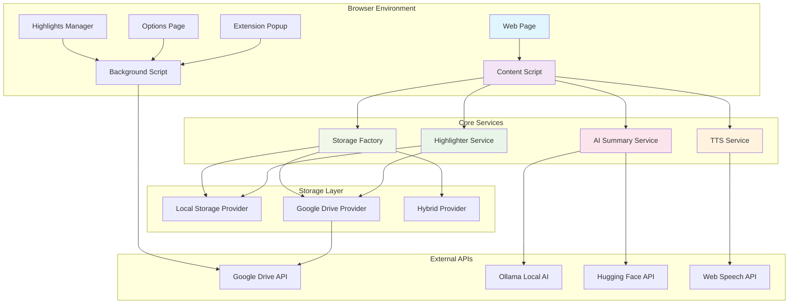
```mermaid
graph TB
    subgraph "Browser Environment"
        A[Web Page] --> B[Content Script]
        C[Extension Popup] --> D[Background Script]
        E[Options Page] --> D
        F[Highlights Manager] --> D
    end

    subgraph "Core Services"
        G[Highlighter Service]
        H[TTS Service]
        I[AI Summary Service]
        J[Storage Factory]
    end

    subgraph "Storage Layer"
        K[Local Storage Provider]
        L[Google Drive Provider]
        M[Hybrid Provider]
    end

    subgraph "External APIs"
        N[Google Drive API]
        O[Ollama Local AI]
        P[Hugging Face API]
        Q[Web Speech API]
    end

    B --> G
    B --> H
    B --> I
    B --> J

    G --> K
    G --> L
    H --> Q
    I --> O
    I --> P
    J --> K
    J --> L
    J --> M

    L --> N
    D --> N

    style A fill:#e1f5fe
    style B fill:#f3e5f5
    style G fill:#e8f5e8
    style H fill:#fff3e0
    style I fill:#fce4ec
    style J fill:#f1f8e9
```

## 📋 Component Architecture

### Content Script Layer

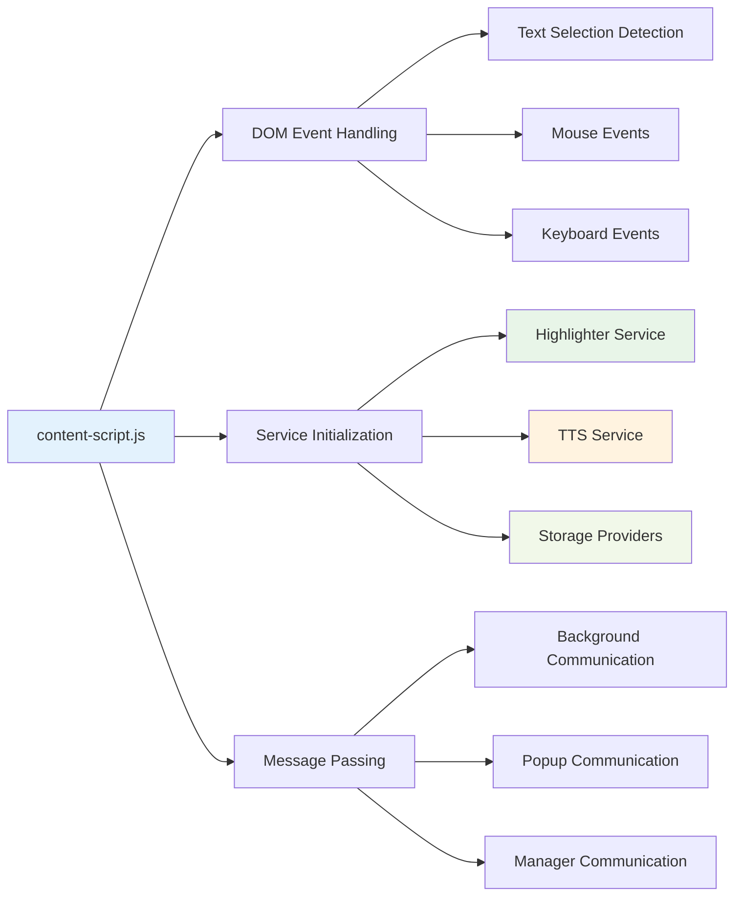
```mermaid
graph LR
    A[content-script.js] --> B[DOM Event Handling]
    A --> C[Service Initialization]
    A --> D[Message Passing]

    B --> E[Text Selection Detection]
    B --> F[Mouse Events]
    B --> G[Keyboard Events]

    C --> H[Highlighter Service]
    C --> I[TTS Service]
    C --> J[Storage Providers]

    D --> K[Background Communication]
    D --> L[Popup Communication]
    D --> M[Manager Communication]

    style A fill:#e3f2fd
    style H fill:#e8f5e8
    style I fill:#fff3e0
    style J fill:#f1f8e9
```

### Services Architecture

```mermaid
graph TB
    subgraph "Highlighter Service"
        A[Range Processing]
        B[DOM Manipulation]
        C[Event Management]
        D[Highlight Storage]
    end

    subgraph "TTS Service"
        E[Language Detection]
        F[Voice Selection]
        G[Speech Synthesis]
        H[Audio Controls]
    end

    subgraph "AI Summary Service"
        I[Text Processing]
        J[Provider Selection]
        K[API Communication]
        L[Fallback Logic]
    end

    subgraph "Storage Factory"
        M[Provider Selection]
        N[Configuration]
        O[Fallback Chain]
        P[Sync Management]
    end

    A --> D
    B --> C
    E --> F
    F --> G
    I --> J
    J --> K
    K --> L
    M --> N
    N --> O
    O --> P

    style A fill:#c8e6c9
    style E fill:#ffecb3
    style I fill:#f8bbd9
    style M fill:#dcedc8
```

## 🔄 Data Flow Diagrams

### Highlight Creation Flow

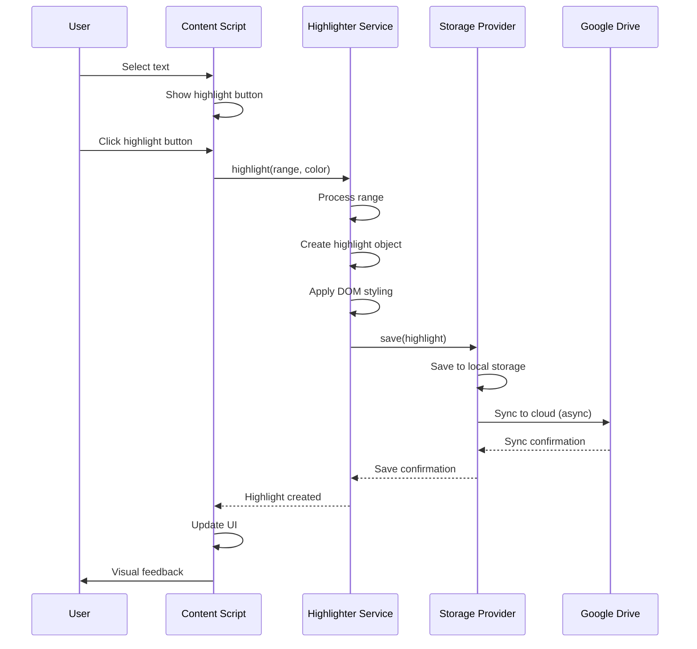
```mermaid
sequenceDiagram
    participant U as User
    participant CS as Content Script
    participant HS as Highlighter Service
    participant SP as Storage Provider
    participant GD as Google Drive

    U->>CS: Select text
    CS->>CS: Show highlight button
    U->>CS: Click highlight button
    CS->>HS: highlight(range, color)

    HS->>HS: Process range
    HS->>HS: Create highlight object
    HS->>HS: Apply DOM styling
    HS->>SP: save(highlight)

    SP->>SP: Save to local storage
    SP->>GD: Sync to cloud (async)
    GD-->>SP: Sync confirmation

    SP-->>HS: Save confirmation
    HS-->>CS: Highlight created
    CS->>CS: Update UI
    CS->>U: Visual feedback
```

### TTS Language Detection Flow

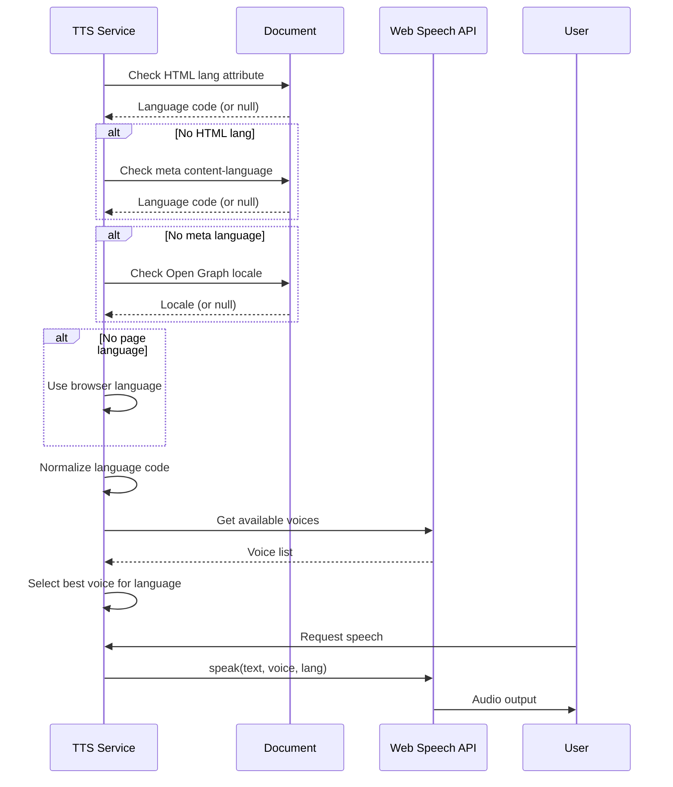
```mermaid
sequenceDiagram
    participant TTS as TTS Service
    participant DOM as Document
    participant WS as Web Speech API
    participant U as User

    TTS->>DOM: Check HTML lang attribute
    DOM-->>TTS: Language code (or null)

    alt No HTML lang
        TTS->>DOM: Check meta content-language
        DOM-->>TTS: Language code (or null)
    end

    alt No meta language
        TTS->>DOM: Check Open Graph locale
        DOM-->>TTS: Locale (or null)
    end

    alt No page language
        TTS->>TTS: Use browser language
    end

    TTS->>TTS: Normalize language code
    TTS->>WS: Get available voices
    WS-->>TTS: Voice list
    TTS->>TTS: Select best voice for language

    U->>TTS: Request speech
    TTS->>WS: speak(text, voice, lang)
    WS->>U: Audio output
```

### AI Summary Generation Flow

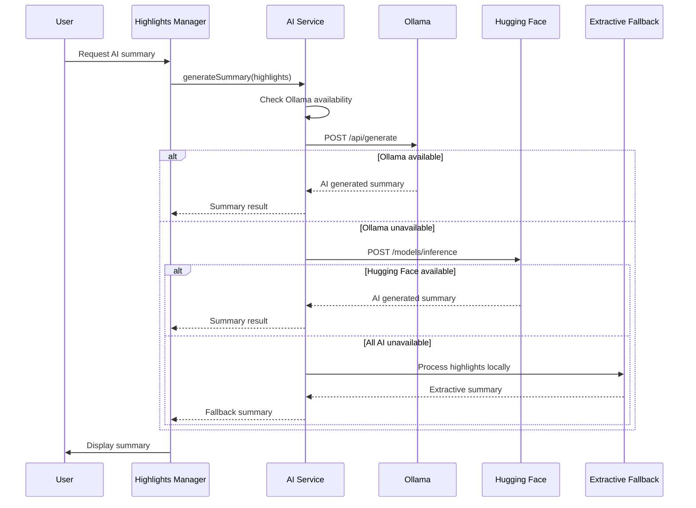
```mermaid
sequenceDiagram
    participant U as User
    participant HM as Highlights Manager
    participant AI as AI Service
    participant OL as Ollama
    participant HF as Hugging Face
    participant EX as Extractive Fallback

    U->>HM: Request AI summary
    HM->>AI: generateSummary(highlights)

    AI->>AI: Check Ollama availability
    AI->>OL: POST /api/generate

    alt Ollama available
        OL-->>AI: AI generated summary
        AI-->>HM: Summary result
    else Ollama unavailable
        AI->>HF: POST /models/inference
        alt Hugging Face available
            HF-->>AI: AI generated summary
            AI-->>HM: Summary result
        else All AI unavailable
            AI->>EX: Process highlights locally
            EX-->>AI: Extractive summary
            AI-->>HM: Fallback summary
        end
    end

    HM->>U: Display summary
```

## 🗄️ Data Models

### Highlight Data Structure

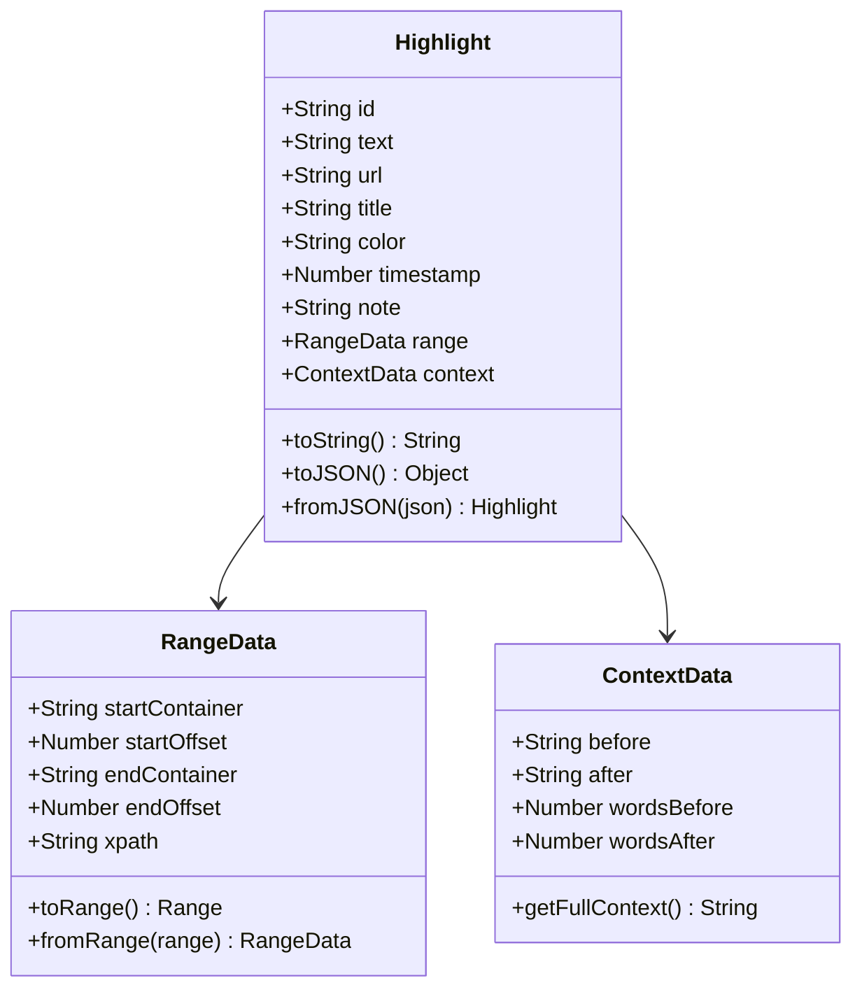
```mermaid
classDiagram
    class Highlight {
        +String id
        +String text
        +String url
        +String title
        +String color
        +Number timestamp
        +String note
        +RangeData range
        +ContextData context

        +toString() String
        +toJSON() Object
        +fromJSON(json) Highlight
    }

    class RangeData {
        +String startContainer
        +Number startOffset
        +String endContainer
        +Number endOffset
        +String xpath

        +toRange() Range
        +fromRange(range) RangeData
    }

    class ContextData {
        +String before
        +String after
        +Number wordsBefore
        +Number wordsAfter

        +getFullContext() String
    }

    Highlight --> RangeData
    Highlight --> ContextData
```

### Storage Provider Interface

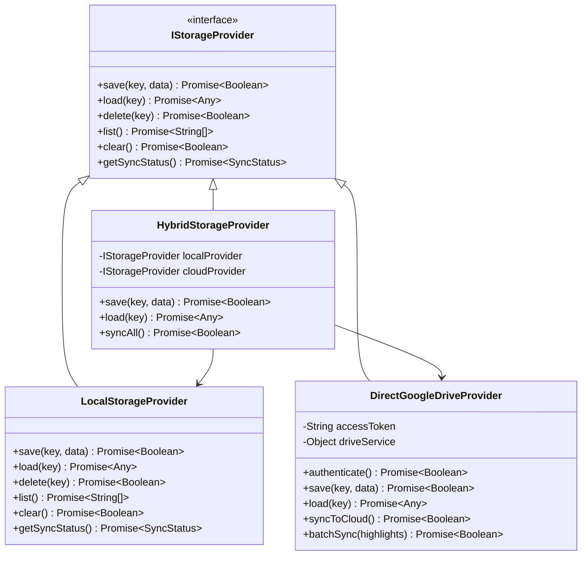
```mermaid
classDiagram
    class IStorageProvider {
        <<interface>>
        +save(key, data) Promise~Boolean~
        +load(key) Promise~Any~
        +delete(key) Promise~Boolean~
        +list() Promise~String[]~
        +clear() Promise~Boolean~
        +getSyncStatus() Promise~SyncStatus~
    }

    class LocalStorageProvider {
        +save(key, data) Promise~Boolean~
        +load(key) Promise~Any~
        +delete(key) Promise~Boolean~
        +list() Promise~String[]~
        +clear() Promise~Boolean~
        +getSyncStatus() Promise~SyncStatus~
    }

    class DirectGoogleDriveProvider {
        -String accessToken
        -Object driveService
        +authenticate() Promise~Boolean~
        +save(key, data) Promise~Boolean~
        +load(key) Promise~Any~
        +syncToCloud() Promise~Boolean~
        +batchSync(highlights) Promise~Boolean~
    }

    class HybridStorageProvider {
        -IStorageProvider localProvider
        -IStorageProvider cloudProvider
        +save(key, data) Promise~Boolean~
        +load(key) Promise~Any~
        +syncAll() Promise~Boolean~
    }

    IStorageProvider <|-- LocalStorageProvider
    IStorageProvider <|-- DirectGoogleDriveProvider
    IStorageProvider <|-- HybridStorageProvider
    HybridStorageProvider --> LocalStorageProvider
    HybridStorageProvider --> DirectGoogleDriveProvider
```

## 🌐 Extension Architecture

### Chrome Extension Structure

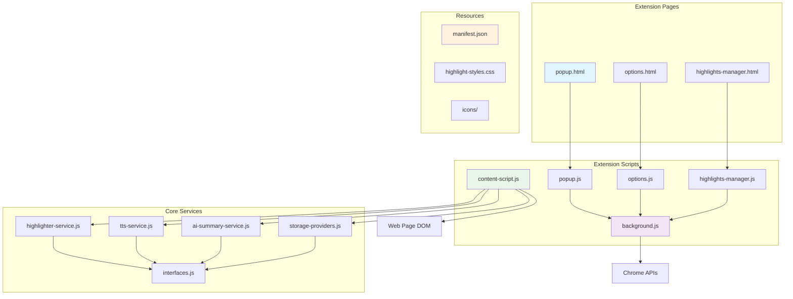
```mermaid
graph TB
    subgraph "Extension Pages"
        A[popup.html]
        B[options.html]
        C[highlights-manager.html]
    end

    subgraph "Extension Scripts"
        D[popup.js]
        E[options.js]
        F[highlights-manager.js]
        G[background.js]
        H[content-script.js]
    end

    subgraph "Core Services"
        I[highlighter-service.js]
        J[tts-service.js]
        K[ai-summary-service.js]
        L[storage-providers.js]
        M[interfaces.js]
    end

    subgraph "Resources"
        N[manifest.json]
        O[highlight-styles.css]
        P[icons/]
    end

    A --> D
    B --> E
    C --> F
    D --> G
    E --> G
    F --> G
    H --> I
    H --> J
    H --> K
    H --> L
    I --> M
    J --> M
    K --> M
    L --> M

    G --> chrome_APIs[Chrome APIs]
    H --> DOM[Web Page DOM]

    style A fill:#e1f5fe
    style G fill:#f3e5f5
    style H fill:#e8f5e8
    style N fill:#fff3e0
```

### Message Passing Architecture

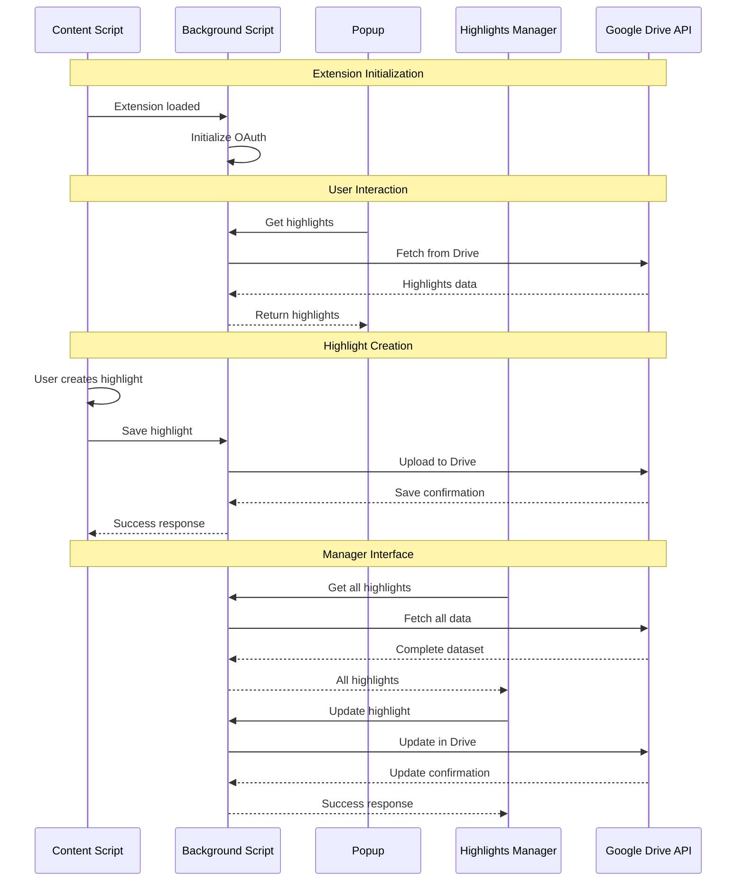
```mermaid
sequenceDiagram
    participant CS as Content Script
    participant BG as Background Script
    participant PU as Popup
    participant HM as Highlights Manager
    participant GD as Google Drive API

    Note over CS,GD: Extension Initialization
    CS->>BG: Extension loaded
    BG->>BG: Initialize OAuth

    Note over CS,GD: User Interaction
    PU->>BG: Get highlights
    BG->>GD: Fetch from Drive
    GD-->>BG: Highlights data
    BG-->>PU: Return highlights

    Note over CS,GD: Highlight Creation
    CS->>CS: User creates highlight
    CS->>BG: Save highlight
    BG->>GD: Upload to Drive
    GD-->>BG: Save confirmation
    BG-->>CS: Success response

    Note over CS,GD: Manager Interface
    HM->>BG: Get all highlights
    BG->>GD: Fetch all data
    GD-->>BG: Complete dataset
    BG-->>HM: All highlights

    HM->>BG: Update highlight
    BG->>GD: Update in Drive
    GD-->>BG: Update confirmation
    BG-->>HM: Success response
```

## 🔧 Technical Implementation

### DOM Manipulation Strategy

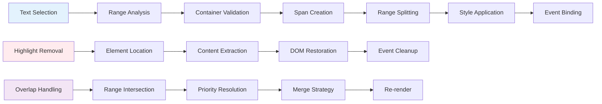
```mermaid
graph LR
    A[Text Selection] --> B[Range Analysis]
    B --> C[Container Validation]
    C --> D[Span Creation]
    D --> E[Range Splitting]
    E --> F[Style Application]
    F --> G[Event Binding]

    H[Highlight Removal] --> I[Element Location]
    I --> J[Content Extraction]
    J --> K[DOM Restoration]
    K --> L[Event Cleanup]

    M[Overlap Handling] --> N[Range Intersection]
    N --> O[Priority Resolution]
    O --> P[Merge Strategy]
    P --> Q[Re-render]

    style A fill:#e3f2fd
    style H fill:#ffebee
    style M fill:#f3e5f5
```

### Storage Synchronization Strategy

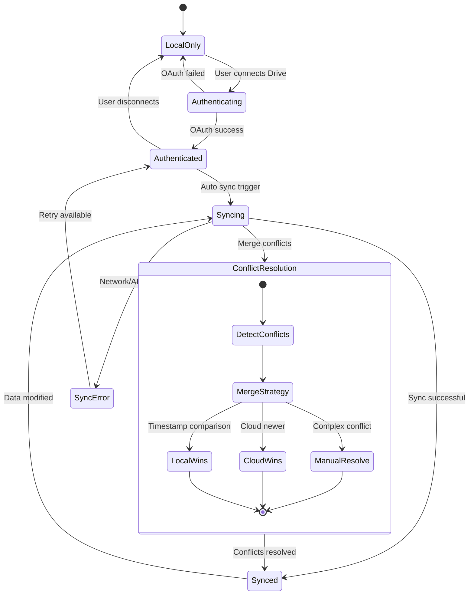
```mermaid
stateDiagram-v2
    [*] --> LocalOnly
    LocalOnly --> Authenticating: User connects Drive
    Authenticating --> Authenticated: OAuth success
    Authenticating --> LocalOnly: OAuth failed

    Authenticated --> Syncing: Auto sync trigger
    Syncing --> Synced: Sync successful
    Syncing --> ConflictResolution: Merge conflicts
    Syncing --> SyncError: Network/API error

    ConflictResolution --> Synced: Conflicts resolved
    SyncError --> Authenticated: Retry available

    Synced --> Syncing: Data modified
    Authenticated --> LocalOnly: User disconnects

    state ConflictResolution {
        [*] --> DetectConflicts
        DetectConflicts --> MergeStrategy
        MergeStrategy --> LocalWins: Timestamp comparison
        MergeStrategy --> CloudWins: Cloud newer
        MergeStrategy --> ManualResolve: Complex conflict
        LocalWins --> [*]
        CloudWins --> [*]
        ManualResolve --> [*]
    }
```

### Language Detection Pipeline

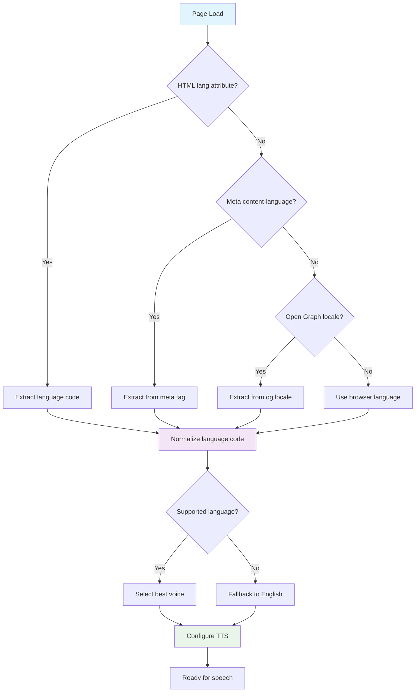
```mermaid
flowchart TD
    A[Page Load] --> B{HTML lang attribute?}
    B -->|Yes| C[Extract language code]
    B -->|No| D{Meta content-language?}

    D -->|Yes| E[Extract from meta tag]
    D -->|No| F{Open Graph locale?}

    F -->|Yes| G[Extract from og:locale]
    F -->|No| H[Use browser language]

    C --> I[Normalize language code]
    E --> I
    G --> I
    H --> I

    I --> J{Supported language?}
    J -->|Yes| K[Select best voice]
    J -->|No| L[Fallback to English]

    K --> M[Configure TTS]
    L --> M

    M --> N[Ready for speech]

    style A fill:#e1f5fe
    style I fill:#f3e5f5
    style M fill:#e8f5e8
```

## 🚀 Performance Optimizations

### Lazy Loading Strategy

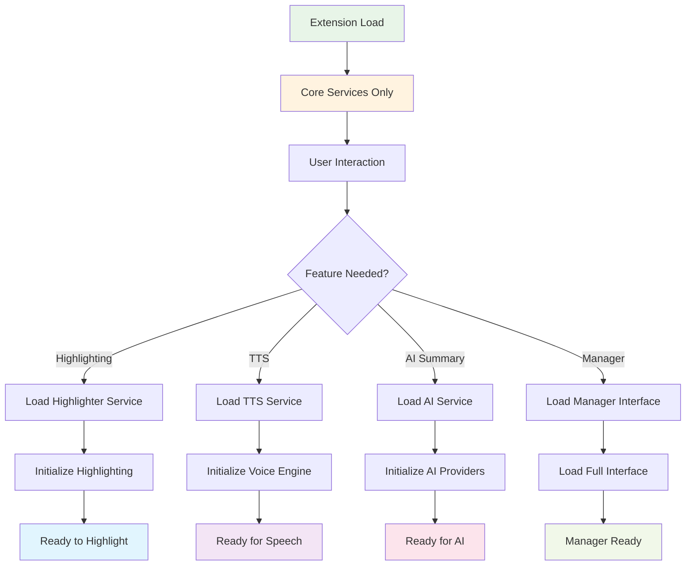
```mermaid
graph TB
    A[Extension Load] --> B[Core Services Only]
    B --> C[User Interaction]

    C --> D{Feature Needed?}
    D -->|Highlighting| E[Load Highlighter Service]
    D -->|TTS| F[Load TTS Service]
    D -->|AI Summary| G[Load AI Service]
    D -->|Manager| H[Load Manager Interface]

    E --> I[Initialize Highlighting]
    F --> J[Initialize Voice Engine]
    G --> K[Initialize AI Providers]
    H --> L[Load Full Interface]

    I --> M[Ready to Highlight]
    J --> N[Ready for Speech]
    K --> O[Ready for AI]
    L --> P[Manager Ready]

    style A fill:#e8f5e8
    style B fill:#fff3e0
    style M fill:#e1f5fe
    style N fill:#f3e5f5
    style O fill:#fce4ec
    style P fill:#f1f8e9
```

### Memory Management

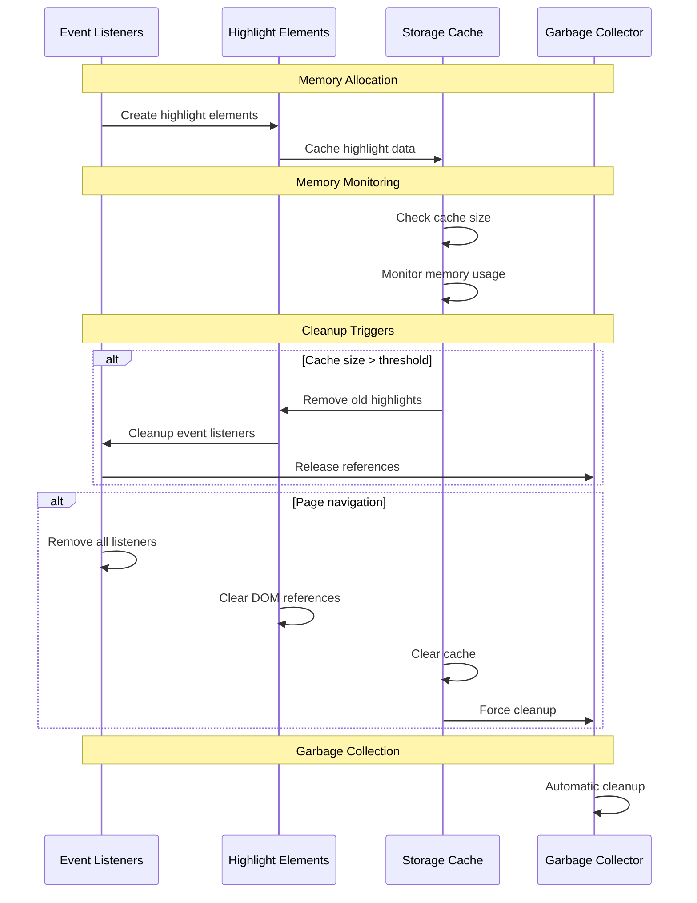
```mermaid
sequenceDiagram
    participant EL as Event Listeners
    participant HL as Highlight Elements
    participant ST as Storage Cache
    participant GC as Garbage Collector

    Note over EL,GC: Memory Allocation
    EL->>HL: Create highlight elements
    HL->>ST: Cache highlight data

    Note over EL,GC: Memory Monitoring
    ST->>ST: Check cache size
    ST->>ST: Monitor memory usage

    Note over EL,GC: Cleanup Triggers
    alt Cache size > threshold
        ST->>HL: Remove old highlights
        HL->>EL: Cleanup event listeners
        EL->>GC: Release references
    end

    alt Page navigation
        EL->>EL: Remove all listeners
        HL->>HL: Clear DOM references
        ST->>ST: Clear cache
        ST->>GC: Force cleanup
    end

    Note over EL,GC: Garbage Collection
    GC->>GC: Automatic cleanup
```

## 🔒 Security Architecture

### Data Flow Security

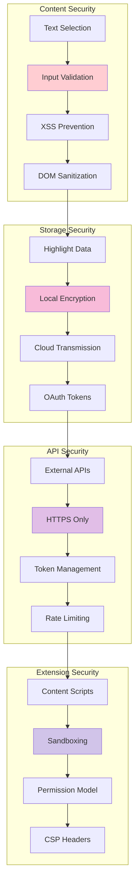
```mermaid
graph TB
    subgraph "Content Security"
        A[Text Selection] --> B[Input Validation]
        B --> C[XSS Prevention]
        C --> D[DOM Sanitization]
    end

    subgraph "Storage Security"
        E[Highlight Data] --> F[Local Encryption]
        F --> G[Cloud Transmission]
        G --> H[OAuth Tokens]
    end

    subgraph "API Security"
        I[External APIs] --> J[HTTPS Only]
        J --> K[Token Management]
        K --> L[Rate Limiting]
    end

    subgraph "Extension Security"
        M[Content Scripts] --> N[Sandboxing]
        N --> O[Permission Model]
        O --> P[CSP Headers]
    end

    D --> E
    H --> I
    L --> M

    style B fill:#ffcdd2
    style F fill:#f8bbd9
    style J fill:#e1bee7
    style N fill:#d1c4e9
```

### Permission Model

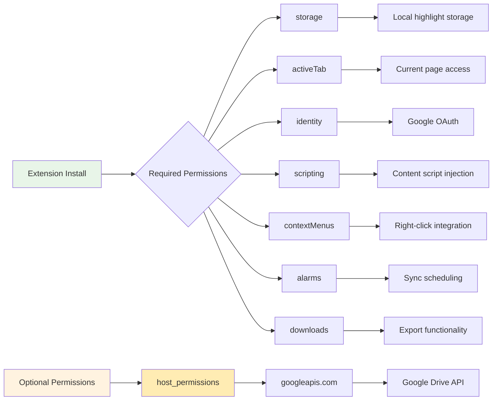
```mermaid
graph LR
    A[Extension Install] --> B{Required Permissions}

    B --> C[storage] --> C1[Local highlight storage]
    B --> D[activeTab] --> D1[Current page access]
    B --> E[identity] --> E1[Google OAuth]
    B --> F[scripting] --> F1[Content script injection]
    B --> G[contextMenus] --> G1[Right-click integration]
    B --> H[alarms] --> H1[Sync scheduling]
    B --> I[downloads] --> I1[Export functionality]

    J[Optional Permissions] --> K[host_permissions]
    K --> L[googleapis.com] --> L1[Google Drive API]

    style A fill:#e8f5e8
    style J fill:#fff3e0
    style K fill:#ffecb3
```

This architecture documentation provides a comprehensive overview of how the Universal Web Highlighter is designed and implemented. Each diagram illustrates different aspects of the system, from high-level architecture to detailed implementation strategies.